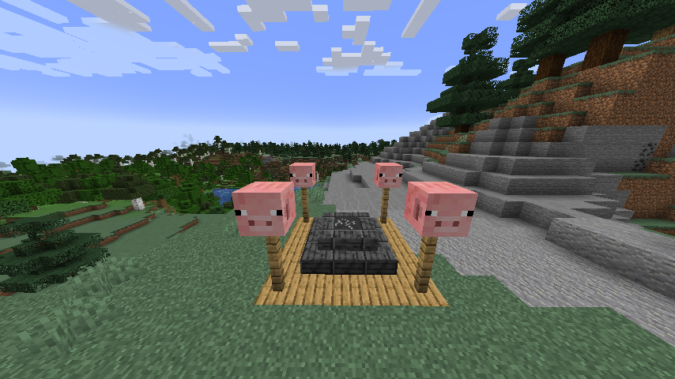

# DST-Touch-Stone-In-Minecraft
This Mod adds in the DST touch stone into Minecraft at the cost of the Totem of Undying being removed from the game. 
Note that the mod was designed for hardcore mode. The mod made for Minecraft Version 1.18.2.

#What Does The Mod Do?
The mod make the world generate a structure that looks like the following:

When you find the structure, you should right-click on the cracked touch stone to activate it.
Once you activate it, you can revive yourself at the touchstone in spectator mode.
The mod also makes the evoker not able to drop the Totem of Undying.

#Download:
You can download the mod on [Github](https://github.com/The-Changer412/DST-Touch-Stone-In-Minecraft/releases/tag/Release) or on [CurseForge](https://www.curseforge.com/minecraft/mc-mods/dst-touch-stone-in-minecraft).